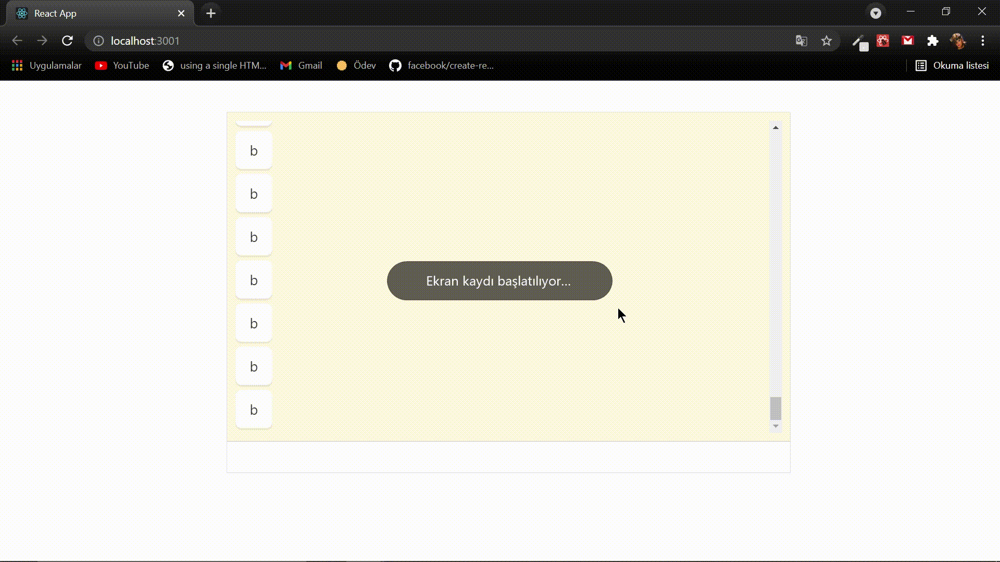

# React Chat App

## Açıklama
Gönderilen mesaj bağlı olan client'lara gönderilir. Gönderen client mesajı sağda görürken alan client mesajı solda görür.

## Kullanılan teknolojiler/araçlar
    React
    Express
    Redis
    Css
    react-scrollable-feed(npmjs)

## Nasıl çalıştırılır?
Repoyu bir dosyaya klonladıktan sonra backend ve client dosyalarında entegre olan komut sistemi açılıp npm i yazılarak bağımlılıklar yüklenir. Redis-server ve redis-cli açıldıktan sonra backend'te açılmış olan komut sistemine npm run dev yazılarak backend ayağa kaldırılır.(npm nodemon yüklü olmalı) Daha sonra client'ta açılmış olan komut sistemine npm start yazılarak frontend ayağa kaldırılır. Bağlanan clientlar, gelen giden mesajlar konsol ekranlarından takip edilebilir.